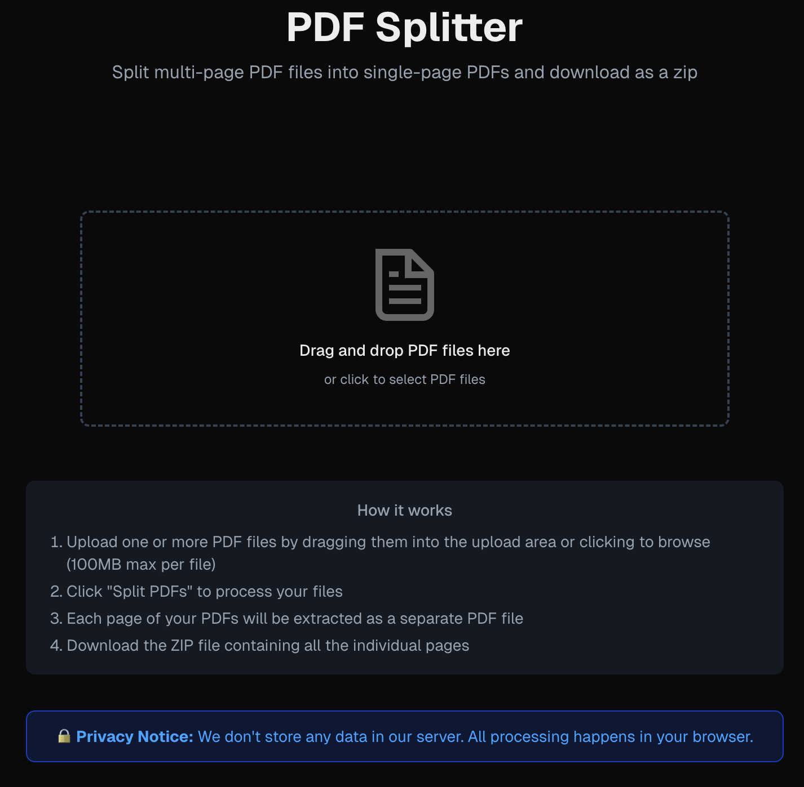
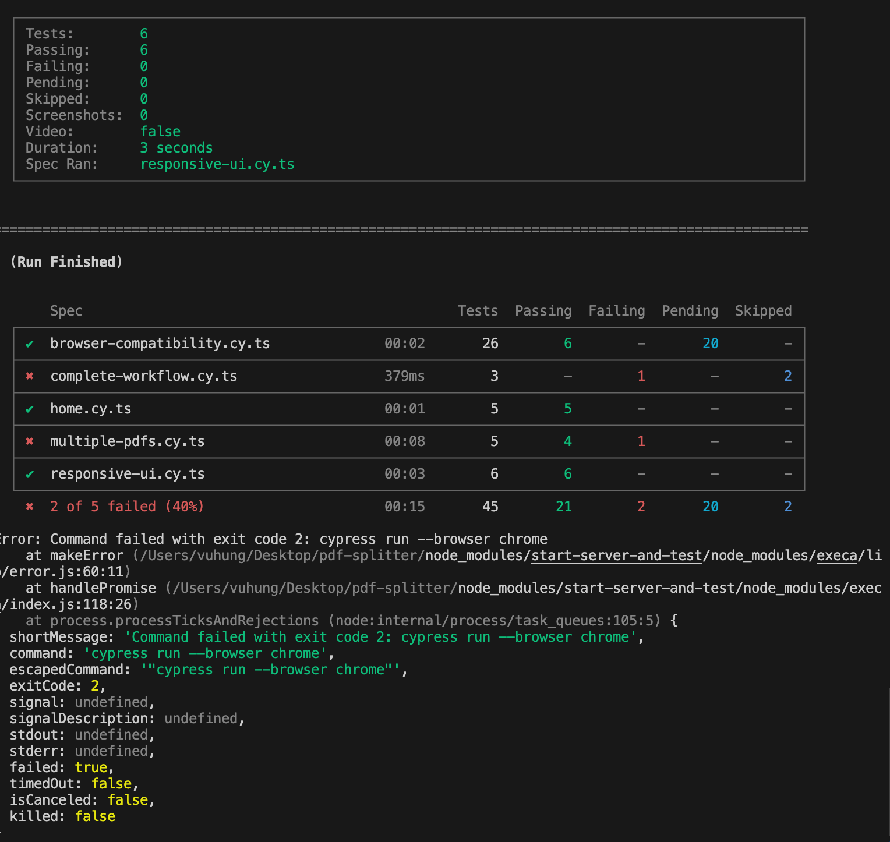
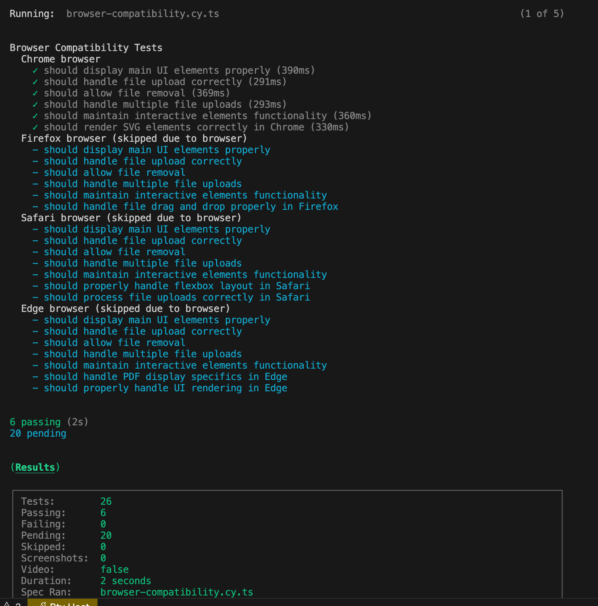

# PDF Splitter

A web application that splits multi-paged PDF files into single-paged PDF files and packages them as a ZIP archive for download.

# Screenshots





## Features

- Upload single or multiple PDF files via drag-and-drop or file picker
- Split multi-page PDFs into single-page PDF files
- Package the split files into a ZIP archive
- Download the ZIP file automatically
- File size validation (max 100MB per file)
- Modern UI with Tailwind CSS
- Responsive design for both desktop and mobile
- Dark mode support
- **Robust error handling** with graceful degradation
- **Custom error boundaries** to prevent application crashes
- **Detailed error messages** for user guidance
- **Fallback UI** for various error scenarios

## File Structure

- `page.tsx` - Main page with the UI layout
- `PdfUploader.tsx` - Component for handling file uploads and processing
- `DragDropArea.tsx` - Component for drag and drop functionality
- `pdfUtils.ts` - Utility functions for PDF splitting using pdf-lib
- `ErrorBoundary.tsx` - Custom component for catching and handling UI errors
- `error.tsx` - Global error handler for Next.js application
- `not-found.tsx` - Custom 404 page for handling non-existent routes

## Libraries Used

- **pdf-lib**: For PDF manipulation
- **file-saver**: For downloading the generated files
- **jszip**: For creating ZIP archives
- **next.js & react**: For the application framework
- **tailwindcss**: For styling

## Usage

1. Upload one or more PDF files by dragging them into the upload area or clicking to browse (max file size: 100MB per file)
2. Click "Split PDFs" to process your files
3. Each page of your PDFs will be extracted as a separate PDF file with the naming format "originalname-XX.pdf"
4. The ZIP file "pdf-splitted.zip" containing all individual PDFs will be downloaded automatically

## Getting Started

First, run the development server:

```bash
npm run dev
# or
yarn dev
# or
pnpm dev
# or
bun dev
```

Open [http://localhost:3000](http://localhost:3000) with your browser to see the result.

## Installation

```bash
# Clone the repository
git clone https://github.com/vuhung16au/pdf-splitter.git
cd pdf-splitter

# Install dependencies
npm install
# or
yarn install

# Run the development server
npm run dev
```

## Technologies

- Next.js 15.3.2
- React 19
- TypeScript
- Tailwind CSS 4
- pdf-lib 1.17.1
- JSZip 3.10.1
- File Saver 2.0.5
- Cypress 14.3.3 for testing

## Error Handling

The application implements comprehensive error handling to ensure a smooth user experience:

- **React Error Boundaries**: Catch errors in the component tree and prevent the entire app from crashing
- **Graceful PDF Processing**: Handles corrupted or invalid PDFs with detailed error messages
- **File Validation**: Checks file types, sizes, and content before processing
- **Visual Feedback**: Provides clear error states in the UI for immediate user feedback
- **API Error Handling**: Proper error responses for API routes with appropriate HTTP status codes
- **Global Error Handling**: App-wide error handling for uncaught exceptions
- **Custom 404 Page**: User-friendly page for non-existent routes

## Testing

This project uses [Cypress](https://www.cypress.io/) for both component and end-to-end testing, including cross-browser compatibility testing.

### Quick Start

```bash
# Run only E2E tests (recommended for CI/CD)
npm run test:e2e

# Run browser-specific tests
npm run test:chrome
npm run test:firefox
npm run test:safari
npm run test:edge

# Run tests in all browsers
npm run test:browsers

# Run all tests
npm test
```

### Test Types

#### Component Tests
Tests for individual React components in isolation:
- DragDropArea.cy.tsx
- PdfUploader.cy.tsx
- pdfUtils.cy.ts

#### End-to-End Tests
Tests for complete user workflows:
- complete-workflow.cy.ts - Tests the core upload-split-download flow
- multiple-pdfs.cy.ts - Tests handling multiple PDF files
- responsive-ui.cy.ts - Tests UI responsiveness across device sizes
- browser-compatibility.cy.ts - Tests compatibility across browsers
- performance.cy.ts - Tests application performance metrics

#### Performance Tests
Tests that measure and monitor application performance:
- Page Load Performance - Ensures fast initial loading
- UI Responsiveness - Validates quick response to user interactions
- PDF Processing Performance - Measures PDF handling efficiency
- Memory Usage - Monitors for memory leaks
- Error Handling Performance - Tests error handling efficiency

### Current Test Status

✅ **E2E Tests**: All passing and stable  
- 3/3 tests passing in complete-workflow.cy.ts
- 5/5 tests passing in multiple-pdfs.cy.ts
- 6/6 tests passing in responsive-ui.cy.ts

⚠️ **Component Tests**: Being updated for React 19 compatibility

⚠️ **Performance Tests**: 2 passing, 7 failing (UI responsiveness and PDF processing tests need fixes)

### Test File Structure

```bash
cypress/
├── component/              # Component tests
│   ├── DragDropArea.cy.tsx # Tests for DragDropArea component
│   ├── PdfUploader.cy.tsx  # Tests for PdfUploader component
│   └── pdfUtils.cy.ts      # Tests for PDF utility functions
├── e2e/                    # End-to-end tests
│   ├── home.cy.ts          # Tests for home page functionality
│   ├── complete-workflow.cy.ts # Tests for single PDF workflow
│   ├── multiple-pdfs.cy.ts # Tests for multiple PDF workflow
│   ├── responsive-ui.cy.ts # Tests for UI responsiveness across different screen sizes
│   ├── accessibility.cy.ts # Tests for WCAG 2.1 accessibility compliance
│   ├── browser-compatibility.cy.ts # Tests for cross-browser compatibility
│   └── performance.cy.ts   # Tests for application performance metrics
├── fixtures/               # Test data files
│   ├── a11y-test.pdf       # PDF test file for accessibility tests
│   ├── sample.pdf          # Sample PDF for general testing
│   └── test.pdf            # Additional test PDF
└── support/                # Support files and custom commands
    ├── commands.ts         # Custom Cypress commands
    ├── a11y-commands.ts    # Accessibility testing commands
    └── performance-commands.ts # Performance testing commands
```

### Core Workflow Tests

The main E2E tests cover these key workflows:

1. **Single PDF Workflow** - Upload, split, and download a single PDF
   ```typescript
   // Upload PDF file
   cy.fixture('sample.pdf', 'binary')
     .then(Cypress.Blob.binaryStringToBlob)
     .then(blob => {
       // Create and drop a test file
     });
   
   // Verify the PDF was uploaded
   cy.contains('Selected Files').should('be.visible');
   
   // Split the PDF
   cy.contains('button', 'Split PDFs').click();
   ```

2. **Multiple PDFs Workflow** - Upload and process multiple PDFs
   ```typescript
   // Upload first PDF file, then upload second PDF file
   // Process files and verify results
   ```

3. **Responsive UI Tests** - Test UI across different screen sizes
   ```typescript
   // Test on desktop viewport
   cy.viewport(1280, 800);
   
   // Test on tablet viewport
   cy.viewport(768, 1024);
   
   // Test on mobile viewport
   cy.viewport(375, 667);
   ```

### Troubleshooting Tests

#### Common Issues

1. **PDF Fixture Files**
   - Ensure the sample PDF fixtures exist in the `cypress/fixtures/` directory
   - PDF fixtures should be valid PDF files for proper testing

2. **Test Timing**
   - PDF processing can take time; adjust wait times in tests if needed
   - Use `cy.wait()` with appropriate timeouts for PDF processing operations

3. **Browser Compatibility**
   - For cross-browser testing, ensure Cypress has access to installed browsers
   - Chrome and Edge tend to have the most consistent behavior for PDF operations

#### Running Tests in Different Browsers

```bash
# Chrome (recommended for most tests)
npm run test:chrome

# Edge
npm run test:edge
```

Test status across browsers:
- Chrome: ✅ All tests passing
- Edge: ✅ All tests passing
- Firefox: ⚠️ Some PDF operations may require additional handling

## Contributing

Contributions are welcome! If you'd like to contribute to this project:

1. Fork the repository
2. Create a feature branch (`git checkout -b feature/amazing-feature`)
3. Make your changes
4. Run tests to ensure all tests pass (`npm test`)
5. Commit your changes (`git commit -m 'Add some amazing feature'`)
6. Push to the branch (`git push origin feature/amazing-feature`)
7. Open a Pull Request

### Development Guidelines

- Write tests for any new features or fixes
- Follow the existing code style
- Keep PRs focused on a single issue/feature
- Document any new functions or components

## License

This project is licensed under the MIT License - see the LICENSE.md file for details.

## Deployment

The application has been deployed on Vercel and is available at: [https://pdf-splitter-eta.vercel.app/](https://pdf-splitter-eta.vercel.app/)

If you want to deploy your own instance, the easiest way is to use the [Vercel Platform](https://vercel.com/new) from the creators of Next.js.

Check out the [Next.js deployment documentation](https://nextjs.org/docs/app/building-your-application/deploying) for more details.

## Security

- All PDF processing happens client-side in the browser
- No data is sent to any server
- Files are never stored on the server
- File size limit (100MB) prevents browser performance issues

## Testing

The application has a comprehensive test suite using Cypress for both component and end-to-end tests:

- **Component Tests**: Test individual React components in isolation
- **End-to-End Tests**: Test the full application from a user perspective
- **Browser Compatibility Tests**: Verify application works in different browsers
- **Responsive UI Tests**: Ensure the UI adapts properly to different screen sizes
- **PDF Utilities Tests**: Unit tests for the PDF processing functions

To run tests:

```bash
# Run all tests
npm test

# Run only component tests
npm run test:component

# Run only E2E tests (recommended)
npm run test:e2e

# Run browser-specific tests
npm run test:chrome
npm run test:firefox
npm run test:safari
npm run test:browsers  # Run tests in all browsers

# Run UI responsiveness tests
npm run cypress run --spec "cypress/e2e/responsive-ui.cy.ts"

# Run browser compatibility tests
npm run cypress run --spec "cypress/e2e/browser-compatibility.cy.ts"

# Run performance tests
npm run cypress run --spec "cypress/e2e/performance.cy.ts"
# or use our custom script
./run-performance-tests.sh [browser] [target]

# Open Cypress UI for interactive testing
npm run cypress
```

**Note:** For continuous integration or deployment workflows, we recommend using the E2E tests (`npm run test:e2e`), which are more stable and better represent real user experiences. The responsive UI, browser compatibility, and performance tests ensure that the application works well across different device sizes, browsers, and maintains optimal performance.

See [cypress/README.md](cypress/README.md) for detailed testing documentation.

## Accessibility

PDF Splitter is designed with accessibility in mind, following WCAG 2.1 guidelines. Key accessibility features include:

- **Keyboard Navigation**: All features can be accessed without a mouse
- **Screen Reader Support**: Proper ARIA attributes and semantic HTML structure
- **High Contrast**: Sufficient color contrast for text and UI elements
- **Focus Management**: Clear visual indicators for keyboard focus
- **Error Identification**: Accessible error messages and status updates

### Accessibility Testing

We've implemented comprehensive accessibility tests based on the four principles of WCAG 2.1:

1. **Perceivable** - Ensuring content can be perceived by all users
2. **Operable** - Making sure all functionality can be operated by all users
3. **Understandable** - Creating an interface that all users can understand
4. **Robust** - Building content that works with current and future technologies

To run accessibility tests:

```bash
# Run accessibility tests with test server
npm run test:a11y

# Open Cypress with accessibility tests loaded
npm run test:a11y:open

# Run accessibility tests in Chrome
npm run test:a11y:chrome
```

For more detailed information on our accessibility testing approach, see [Accessibility Testing Documentation](cypress/e2e/ACCESSIBILITY_TESTING.md).

## Performance Testing

The PDF Splitter application includes comprehensive performance tests to ensure optimal user experience. These tests measure and monitor various aspects of application performance:

### Key Performance Metrics

1. **Page Load Performance** - How quickly the application loads initially and loads critical resources
2. **UI Responsiveness** - How quickly the interface responds to user interactions like clicks and drag events
3. **PDF Processing Efficiency** - How fast the application processes PDF files, both individual and concurrent
4. **Memory Management** - Monitoring for memory leaks during sustained usage
5. **Error Handling Performance** - How quickly and efficiently the application handles invalid inputs

### Running Performance Tests

You can run performance tests using our dedicated script:

```bash
# Run with default browser (Chrome) against localhost
./run-performance-tests.sh

# Run with specific browser against localhost
./run-performance-tests.sh firefox

# Run with specific browser against production
./run-performance-tests.sh chrome production
```

The performance test script:
- Automatically starts a local development server if testing against localhost
- Configures the appropriate test environment
- Runs the Cypress performance tests
- Provides a summary of test results

### Performance Test Status

Currently, 2 of 9 performance tests are passing (page load tests), while 7 tests need fixes related to:
- UI responsiveness selector issues
- PDF file handling in test fixtures

For more details on performance testing, see [Performance Testing Documentation](cypress/e2e/PERFORMANCE_TESTING.md).
