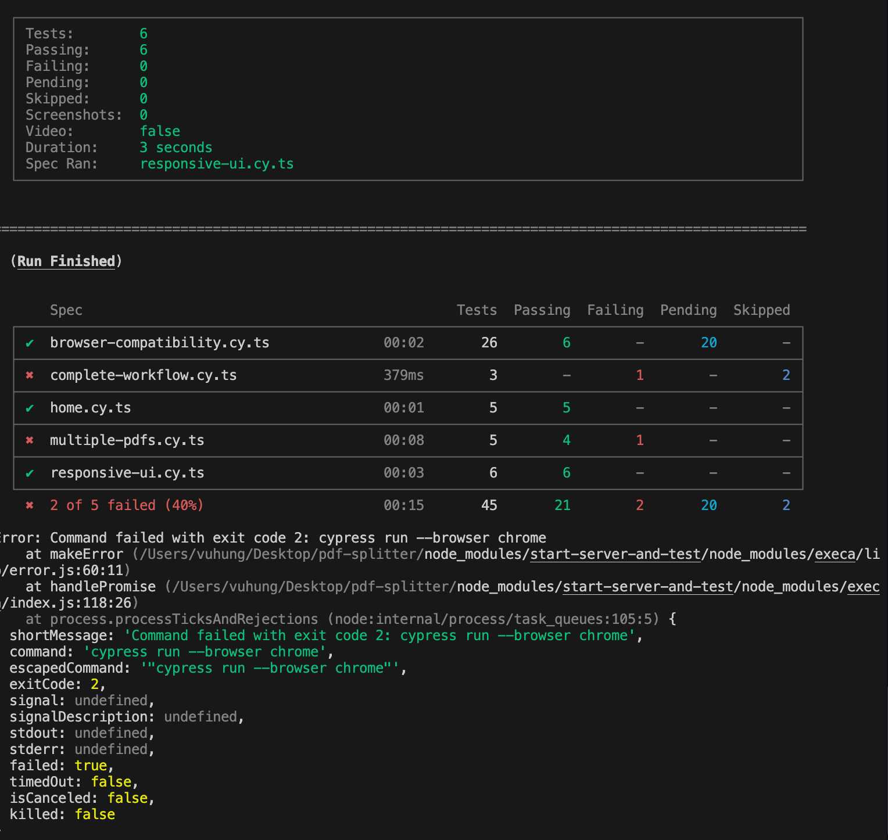

# Testing Guide for PDF Splitter

This project uses [Cypress](https://www.cypress.io/) for both component and end-to-end testing, including cross-browser compatibility and accessibility testing.

## Quick Start

```bash
# Run only E2E tests (recommended for CI/CD)
npm run test:e2e

# Run browser-specific tests
npm run test:chrome
npm run test:firefox
npm run test:safari
npm run test:edge

# Run tests in all browsers
npm run test:browsers

# Run accessibility tests in specific browser
npm run test:a11y:chrome
npm run test:a11y:firefox
npm run test:a11y:edge

# Run accessibility tests in all browsers
npm run test:a11y:all

# Run all tests
npm test
```

## Test Types

### Component Tests

Component tests verify that individual React components work correctly in isolation. These tests:
- Mount components directly
- Test UI interactions and state changes
- Are faster than E2E tests and focus on component behavior

### End-to-End Tests

E2E tests verify that the application works correctly from the user's perspective. These tests:
- Open a real browser and navigate through the application
- Test complete user flows (uploading PDFs, splitting, downloading)
- Ensure all parts of the application work together

## Running Tests

**Note:** Some component tests are currently being updated to handle React 19 and the latest Cypress version (14.x). For CI/CD pipelines, we recommend focusing on the E2E tests which provide the best coverage of critical user workflows.

### Current Status

✅ **E2E Tests**: All passing and stable  
⚠️ **Component Tests**: Being updated for React 19 compatibility  
⚠️ **Accessibility Tests**: 9 passing, 8 failing across all browsers

- DragDropArea component tests: 4 passing, 2 failing
- PdfUploader component tests: 4 passing, 1 failing
- PDF Utilities tests: 1 passing, 2 failing
- E2E Complete Workflow tests: 2 passing
- E2E Multiple PDF Files tests: 4 passing
- E2E Responsive UI tests: 6 passing
- Accessibility tests: 9 passing, 8 failing (consistent across Chrome, Firefox, and Edge)

### Testing Environments

You can run tests against either your local development server or the production server:

```bash
# Test against localhost (default)
./run-tests.sh e2e chrome

# Test against production server
./run-tests.sh e2e chrome production

# Run browser compatibility tests against production
./run-tests.sh e2e chrome production true
```

### Using npm scripts

```bash
# Run all tests (both component and E2E)
npm test

# Run only component tests
npm run test:component

# Run only E2E tests (starts the dev server automatically)
npm run test:e2e

# Run specific workflow test
npm run cypress run --spec "cypress/e2e/complete-workflow.cy.ts"

# Run multiple PDFs workflow test
npm run cypress run --spec "cypress/e2e/multiple-pdfs.cy.ts"

# Run responsive UI tests
npm run cypress run --spec "cypress/e2e/responsive-ui.cy.ts"

# Run accessibility tests in Chrome
npm run test:a11y:chrome

# Run accessibility tests in all browsers (Chrome, Firefox, Edge)
npm run test:a11y:all

# Open Cypress interactive runner
npm run cypress
```

### Using the Cypress UI

For a more interactive experience with visual feedback:

```bash
npm run cypress
```

This will open the Cypress Test Runner where you can choose to run component tests or E2E tests.

### Testing Against Production

To run tests against the production deployment at the Vercel URL:

```bash
# Run all E2E tests against production
./run-tests.sh e2e chrome production

# Run browser compatibility tests against production
./run-tests.sh e2e chrome production true

# Test specific browser against production
./run-tests.sh e2e firefox production
```

The script automatically detects the target environment and configures Cypress accordingly without starting a local development server when running against production.

## Test File Structure

```bash
cypress/
├── component/              # Component tests
│   ├── DragDropArea.cy.tsx # Tests for DragDropArea component
│   ├── PdfUploader.cy.tsx  # Tests for PdfUploader component
│   └── pdfUtils.cy.ts      # Tests for PDF utility functions
├── e2e/                    # End-to-end tests
│   ├── home.cy.ts          # Tests for home page functionality
│   ├── complete-workflow.cy.ts # Tests for single PDF workflow
│   ├── multiple-pdfs.cy.ts # Tests for multiple PDF workflow
│   ├── responsive-ui.cy.ts # Tests for UI responsiveness across different screen sizes
│   ├── accessibility.cy.ts # Tests for WCAG 2.1 accessibility compliance
│   └── browser-compatibility.cy.ts # Tests for cross-browser compatibility
├── fixtures/               # Test data files
│   ├── a11y-test.pdf       # PDF test file for accessibility tests
│   └── sample.pdf          # Sample PDF for general testing
├── support/                # Support files and custom commands
│   ├── commands.ts         # Custom Cypress commands
│   ├── a11y-commands.ts    # Accessibility testing commands
│   ├── component.ts        # Component test configuration
│   └── e2e.ts              # E2E test configuration
├── screenshots/            # Test failure screenshots
│   └── accessibility.cy.ts/# Accessibility test failure screenshots
└── tsconfig.json           # TypeScript configuration for tests
```

## Writing New Tests

### Component Test Example

```typescript
import MyComponent from '../../app/components/MyComponent';

describe('MyComponent', () => {
  beforeEach(() => {
    cy.mount(<MyComponent prop="value" />);
  });

  it('should render correctly', () => {
    cy.contains('Expected text').should('be.visible');
  });
});
```

### E2E Test Example

```typescript
describe('User flow', () => {
  it('should allow uploading and processing a PDF', () => {
    cy.visit('/');
    cy.get('[data-testid="pdf-uploader"]').should('exist');
    // Simulate file upload and verify results
  });
});
```

## Mocking External Services

For tests that require mocking external services or APIs:

```typescript
// Mock file saving
cy.stub(fileSaver, 'saveAs').as('saveAsStub');

// Verify mock was called correctly
cy.get('@saveAsStub').should('have.been.called');
```

## Best Practices

1. Add `data-testid` attributes to important UI elements
2. Keep tests independent and focused
3. Clean up state between tests
4. Minimize test flakiness by using reliable selectors
5. Test both success and error cases

## Core Workflow Tests

We have dedicated end-to-end tests that cover the complete user workflows and responsive UI:

### Single PDF Workflow

```typescript
// From cypress/e2e/complete-workflow.cy.ts
it('should upload a PDF file, split it, and download the result', () => {
  // Step 1: Upload a PDF file
  cy.fixture('sample.pdf', 'binary')
    .then(Cypress.Blob.binaryStringToBlob)
    .then(blob => {
      const testFile = new File([blob], 'sample.pdf', { type: 'application/pdf' });
      const dataTransfer = new DataTransfer();
      dataTransfer.items.add(testFile);
      
      cy.get('[data-testid="pdf-uploader"]').trigger('drop', { 
        dataTransfer: { files: dataTransfer.files }
      });
    });
  
  // Step 2: Split the PDF
  cy.get('[data-testid="split-button"]').click();
  
  // Step 3: Download the ZIP file
  cy.get('[data-testid="download-zip-button"]').click();
  
  // Verify the download was triggered
  cy.get('@saveAsStub').should('have.been.calledOnce');
});
```

### Multiple PDF Files Workflow

```typescript
// From cypress/e2e/multiple-pdfs.cy.ts
it('should upload multiple PDF files one after another', () => {
  // Upload first PDF file
  cy.fixture('sample.pdf', 'binary')
    .then(Cypress.Blob.binaryStringToBlob)
    .then(blob => {
      const testFile = new File([blob], 'sample.pdf', { type: 'application/pdf' });
      const dataTransfer = new DataTransfer();
      dataTransfer.items.add(testFile);
      
      cy.get('[data-testid="pdf-uploader"]').trigger('drop', { 
        dataTransfer: { files: dataTransfer.files, types: ['Files'] }
      });
    });
  
  // Verify first file was uploaded
  cy.contains('Selected Files (1)').should('be.visible');
  
  // Upload second PDF file
  cy.fixture('test.pdf', 'binary')
    .then(Cypress.Blob.binaryStringToBlob)
    .then(blob => {
      const testFile = new File([blob], 'test.pdf', { type: 'application/pdf' });
      const dataTransfer = new DataTransfer();
      dataTransfer.items.add(testFile);
      
      cy.get('[data-testid="pdf-uploader"]').trigger('drop', { 
        dataTransfer: { files: dataTransfer.files, types: ['Files'] }
      });
    });
  
  // Process files and test error handling
  it('should handle error when processing an invalid PDF file', () => {
    // Create an invalid PDF file and verify error message appears
  });
});
```

### UI Responsiveness Tests

Our UI responsiveness tests validate that the PDF Splitter application is fully responsive across different device sizes, from desktop to mobile. These tests:

```typescript
// From cypress/e2e/responsive-ui.cy.ts
describe('UI Responsiveness Tests', () => {
  it('should display correctly on desktop viewport', () => {
    // Set viewport to desktop size
    cy.viewport(1280, 800);
    
    // Check that elements are properly sized and visible
    cy.get('header h1').should('be.visible');
    cy.get('[data-testid="pdf-uploader"]').should('be.visible');
    // More assertions...
  });

  it('should adapt to tablet viewport', () => {
    cy.viewport(768, 1024);
    // Verify that UI adapts to medium-sized screens
  });

  it('should be fully responsive on mobile viewport', () => {
    cy.viewport(375, 667); // iPhone SE size
    // Verify that UI adapts to small screens
  });

  it('should maintain functional upload area in all screen sizes', () => {
    // Test PDF uploading functionality across multiple viewport sizes
    const viewports = [
      { width: 1280, height: 800, name: 'desktop' },
      { width: 768, height: 1024, name: 'tablet' },
      { width: 375, height: 667, name: 'mobile' }
    ];
    
    viewports.forEach(size => {
      cy.viewport(size.width, size.height);
      // Test file uploading and verify UI responses
    });
  });

  it('should maintain proper layout during window resize', () => {
    // Test dynamic resizing from large to small viewports
  });

  it('should handle PDF uploads and display file list responsively', () => {
    // Test that the file list display is properly responsive
  });
});
```

### Mobile Testing

Our mobile testing suite ensures that the PDF Splitter application provides an optimal experience on mobile devices. The tests are organized into several categories:

#### Running Mobile Tests

```bash
# Run all mobile tests
./run-tests.sh mobile chrome localhost false false false false false true

# Run mobile tests against production
./run-tests.sh mobile chrome production false false false false false true

# Run specific mobile test file
npm run cypress run --spec "cypress/e2e/mobile/touch-events.cy.ts"
```

#### Mobile Test Structure

```bash
cypress/e2e/mobile/
├── touch-events.cy.ts     # Tests for touch interactions
├── gestures.cy.ts         # Tests for mobile gestures
├── viewport.cy.ts         # Tests for viewport behavior
├── performance.cy.ts      # Tests for mobile performance
└── file-handling.cy.ts    # Tests for mobile file operations
```

#### Mobile Test Categories

1. **Touch Events**
   - Basic touch interactions (tap, touchstart, touchend)
   - Touch and drag events
   - Long press events
   ```typescript
   // From cypress/e2e/mobile/touch-events.cy.ts
   describe('Touch Events', () => {
     it('should handle basic touch events', () => {
       cy.viewport('iphone-x');
       cy.get('[data-testid="pdf-uploader"]')
         .trigger('touchstart', { touches: [{ clientX: 100, clientY: 100 }] })
         .should('have.class', 'active');
     });
   });
   ```

2. **Mobile Gestures**
   - Pinch-to-zoom functionality
   - Swipe gestures
   - Double tap interactions
   ```typescript
   // From cypress/e2e/mobile/gestures.cy.ts
   describe('Mobile Gestures', () => {
     it('should handle pinch-to-zoom gestures', () => {
       cy.viewport('iphone-x');
       cy.get('main')
         .trigger('gesturestart', { scale: 1 })
         .trigger('gesturechange', { scale: 2 })
         .trigger('gestureend', { scale: 2 });
     });
   });
   ```

3. **Viewport Behavior**
   - Adaptation to different mobile viewport sizes
   - Orientation changes (portrait/landscape)
   - Touch-friendly element sizes
   - Proper spacing between elements
   ```typescript
   // From cypress/e2e/mobile/viewport.cy.ts
   describe('Mobile Viewport Tests', () => {
     it('should adapt to different mobile viewport sizes', () => {
       const mobileDevices = [
         { device: 'iphone-x', width: 375, height: 812 },
         { device: 'iphone-6', width: 375, height: 667 },
         { device: 'pixel-2', width: 411, height: 731 }
       ];
       // Test each device viewport
     });
   });
   ```

4. **Mobile Performance**
   - Smooth scrolling performance
   - Touch event response time
   - Resource loading efficiency
   - File operation performance
   ```typescript
   // From cypress/e2e/mobile/performance.cy.ts
   describe('Mobile Performance Tests', () => {
     it('should maintain smooth scrolling', () => {
       cy.window().then((win) => {
         const startTime = performance.now();
         cy.get('body').scrollTo('bottom', { duration: 1000 });
         // Verify scroll performance
       });
     });
   });
   ```

5. **Mobile File Handling**
   - Single file selection
   - Multiple file selection
   - File removal
   - File size limits
   ```typescript
   // From cypress/e2e/mobile/file-handling.cy.ts
   describe('Mobile File Handling', () => {
     it('should handle single file selection', () => {
       cy.get('[data-testid="pdf-uploader"]')
         .find('input[type="file"]')
         .selectFile({
           contents: Cypress.Buffer.from('test PDF content'),
           fileName: 'mobile-test.pdf',
           mimeType: 'application/pdf'
         }, { force: true });
     });
   });
   ```

#### Custom Mobile Commands

We've implemented custom Cypress commands specifically for mobile testing:

```typescript
// From cypress/support/mobile-commands.ts
Cypress.Commands.add('touch', { prevSubject: 'element' }, (subject, eventType, options) => {
  // Custom touch event command
});

Cypress.Commands.add('swipe', { prevSubject: 'element' }, (subject, direction, distance) => {
  // Custom swipe gesture command
});

Cypress.Commands.add('longPress', { prevSubject: 'element' }, (subject, duration) => {
  // Custom long press command
});
```

#### Mobile Testing Best Practices

1. **Viewport Configuration**
   - Always set appropriate viewport size before tests
   - Test across multiple device sizes
   - Consider both portrait and landscape orientations

2. **Touch Interactions**
   - Use touch events instead of mouse events
   - Test both single and multi-touch interactions
   - Verify touch feedback and visual states

3. **Performance Considerations**
   - Monitor scroll performance
   - Check touch response times
   - Verify resource loading efficiency

4. **File Operations**
   - Test file selection on mobile
   - Verify file size limits
   - Check error handling for invalid files

5. **Accessibility on Mobile**
   - Ensure touch targets are large enough (minimum 44x44px)
   - Verify proper spacing between interactive elements
   - Test with screen readers on mobile devices

## Accessibility Testing

Our application is committed to meeting WCAG 2.1 accessibility standards. We run comprehensive accessibility tests across multiple browsers to ensure our interface is accessible to all users, including those using assistive technologies.

### Running Accessibility Tests

To run the accessibility tests in a specific browser:

```bash
# Run in Chrome
npm run test:a11y:chrome

# Run in Firefox
npm run test:a11y:firefox

# Run in Edge
npm run test:a11y:edge

# Run in all browsers
npm run test:a11y:all
```

### Accessibility Test Structure

The accessibility tests are organized according to the four WCAG 2.1 principles:

1. **Perceivable** - Information and user interface components must be presentable to users in ways they can perceive.
   - Testing for text alternatives for images
   - Proper heading structure
   - Sufficient color contrast
   - Text resizing without loss of content

2. **Operable** - User interface components and navigation must be operable.
   - Keyboard accessibility
   - Proper focus management
   - Tab order for interactive elements
   - Sufficient time for interactions

3. **Understandable** - Information and operation of the user interface must be understandable.
   - Predictable navigation
   - Clear feedback and error messages
   - Instructions for form elements

4. **Robust** - Content must be robust enough to be interpreted by a wide variety of user agents.
   - Valid HTML structure
   - Proper ARIA roles for custom interactive elements
   - Associated labels with interactive elements

### Cross-Browser Accessibility Testing

We use the `run-a11y-cross-browser.sh` script to run accessibility tests across Chrome, Firefox, and Edge browsers to ensure consistent accessibility support. Test results and screenshots are saved in the `cypress/screenshots/accessibility.cy.ts/` directory.

## Troubleshooting

### Common Issues

1. **Component Test Failures with React 19**
   - The `mount` function from Cypress may need updates to work with React 19
   - Use `cy.stub()` inside `beforeEach()` hooks, not outside them
   - Don't directly reference spies across test cases; use aliases

2. **Styling Class Assertions**
   - Target specific elements with more precise selectors
   - Use `data-testid` attributes where possible instead of class names
   - Check for presence of class with `.should('have.class', 'class-name')`

3. **PDF File Mocking**
   - Be aware that you can't fully test PDF processing in component tests
   - Focus on validating function calls and error states
   - Use E2E tests for full validation of the PDF processing workflow

4. **SaveAs Testing Issues**
   - When testing file downloads, you may encounter issues with the saveAs stub
   - For reliable tests, focus on verifying UI state changes rather than the actual download

5. **Accessibility Test Failures**
   - Color contrast issues are common and can be fixed by adjusting theme colors
   - Keyboard accessibility issues often require adding proper `tabindex` attributes
   - Some tests may fail due to missing `role` attributes on custom components
   - When running `cy.click()` on multiple elements, use `{ multiple: true }` option or refine selectors
   - File selection issues in tests often relate to problems with the test files rather than the app

## Screenshots

### Browser Compatibility & Responsive UI

  

### Test Failures & Diagnostics

 


### Accessibility Testing
The latest accessibility test screenshots are stored in the `cypress/screenshots/accessibility.cy.ts/` directory. These show the specific WCAG failures identified by our automated tests and help guide our accessibility improvements.

